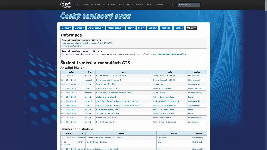
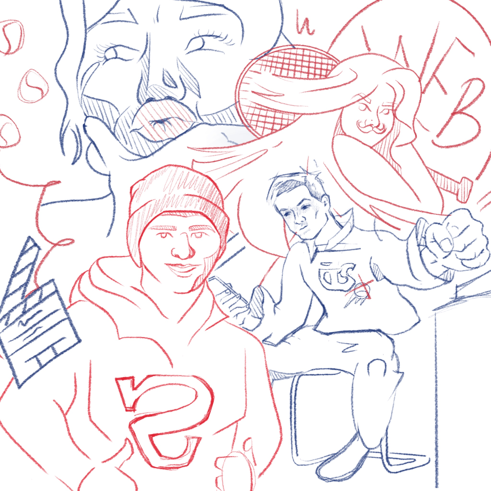
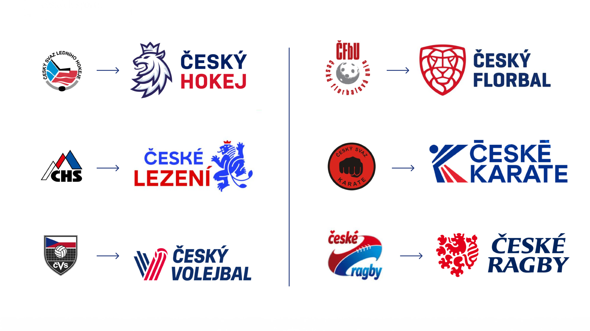
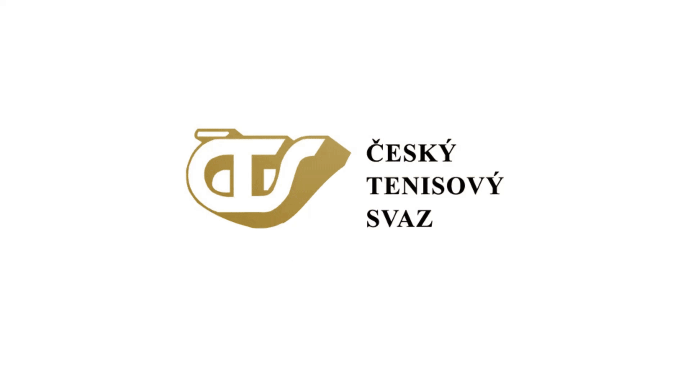
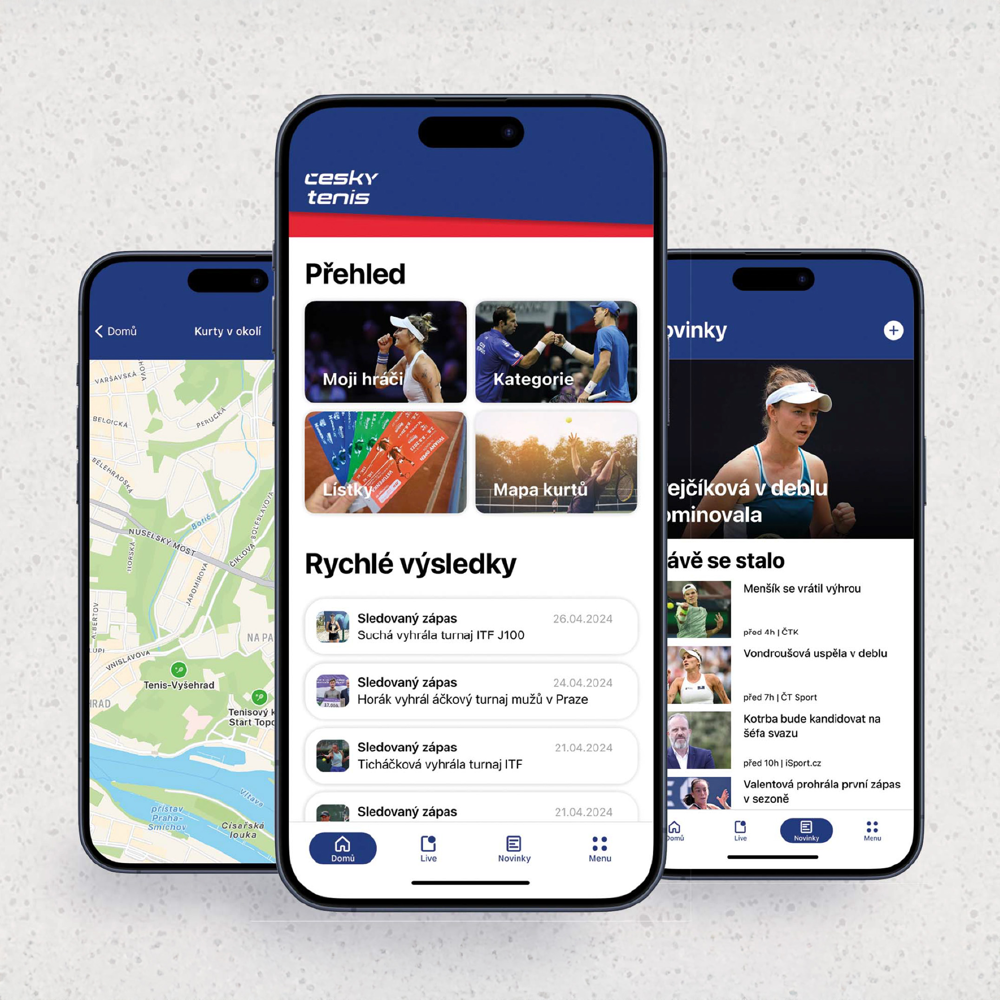
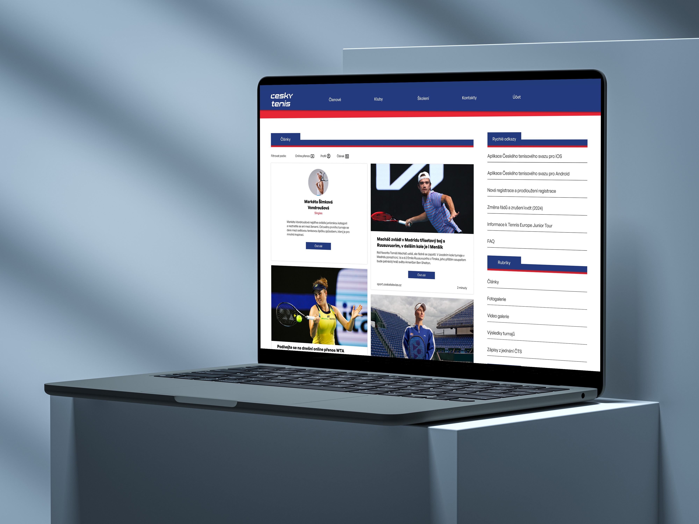
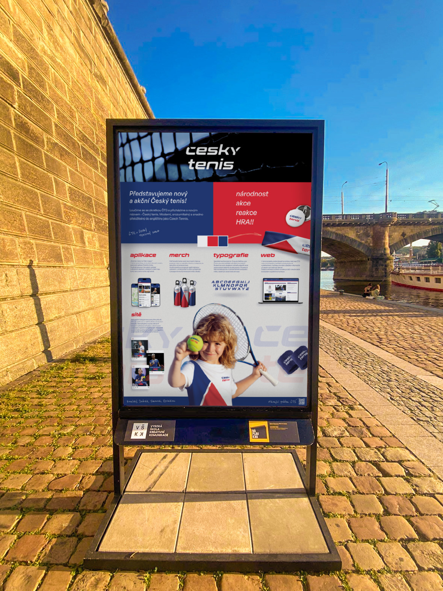
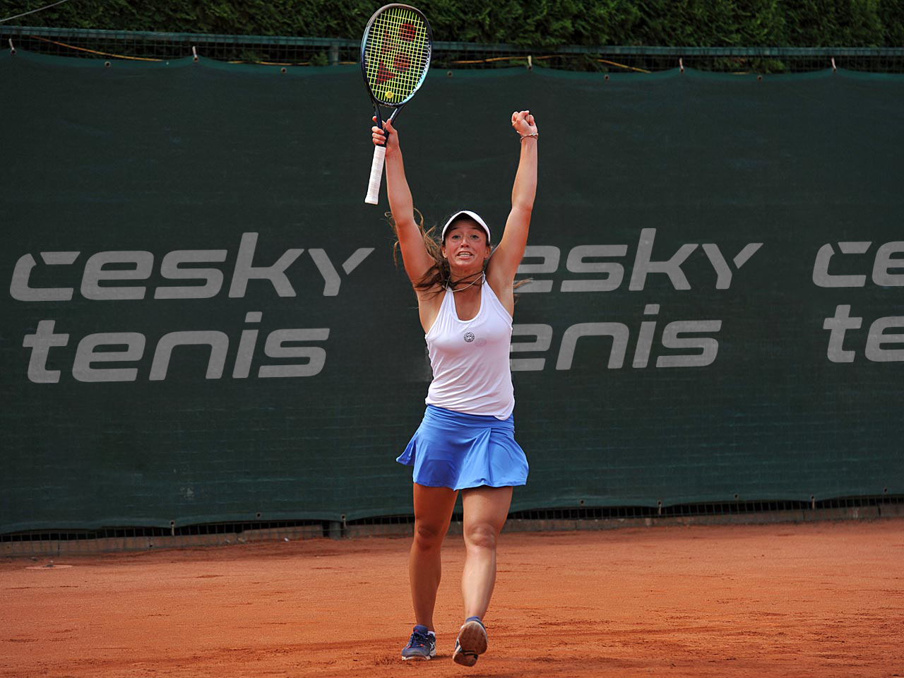

# Crafting a casestudy

## Uniting CZECH TENNIS
  
We had no time to start small. ČTS was the last sport waiting for a rebrand, and everything needed to change—immediately.

The ČTS (Czech Tennis Association) was facing financial scandals. Leadership changes! And definitely a damaged reputation.  

The project was about more than just design. It was a chance to reset Czech tennis. Giving it an identity that could unite both professionals and everyday players.  Making it recognizable on courts around the world. I took charge of the brand identity, making sure Czech tennis would have a strong and unified visual presence. At the same time, our team tackled every other aspect of the transformation. We designed the app, social media, and managed everything in between. Just take a look!

  

### A fragmented sport in need of a strong identity

A new visual style that brings together a community that is otherwise every man for himself.
The goal of the project was to create a strong and memorable brand that could represent Czech
professional tennis players at tournaments around the world as well as bring together enthusiastic
tennis amateurs.

The need for a complete transformation of the visual style also follows the transformation 
of the visual identities of other Czech sports. During the design process, my colleagues and 
I were looking for a representation of Czech tennis that would stand out on both the local and international scene.

  

### Beyond the logo: A full-scale transformation
#### Typography with the right spin
Specially designed font. What's for Czechs and the Czech Republic more characteristic than special diacritic? 
The new typography supports the trend of incorporating diacritics into the body of letters. The punctuation also symbolizes the strength of the and speed of a flying tennis ball. Ideal for dynamic animations!

#### Game, set, merch
Proud tennis fans will appreciate the new merch, which is written not only on badges, headbands and wristbands but also directly on tennis jerseys. The visual identity is written across the players' equipment. So it's always in plain sight and contributes to connect the community of tennis players 
and spectators.

 

#### Tennis in your pocket (app)
>„Tenis ten máme my Češi v kapse.“
>(Czechs have tennis in the pocket = 
we nailed it.)

As part of the rebranding, we also worked on a new Czech Tennis app. It provides tennis fans with an overview of current matches, results and a map of courts where they can go to play. 

 

#### Web for all who score
As part of the project, the ČTS website also underwent a major transformation. Its new design is based on simplicity and clarity. A few clicks are now enough to access all important information and functions. Easy to navigate and navigation on the website is nowadays is the standard for successful communication.

space for:
- articles
- photos
- events

 

#### Breaking the net (social media)
Our take: Instagram posts directly through the network.The goal is to reach as wide a base of tennis fans as possible. New posts are therefore divided into three categories: daily posts with information, inspirational posts where ambassadors and famous players explain tennis to kids and teenagers, and interesting facts about the world of tennis and its history.

### We are keeping score
The project was named the overall best-rated work and earned a spot at the Náplavkka exhibition to represent VŠKK. 

> VŠKK (prague school of creative communication) is a college specializing in creative fields such as media communications. The Náplavkka exhibition itself serves as a platform to showcase the best student projects, allowing them to reach a broader audience and highlighting the significant impact of well-executed design.  

#### Creators: 

Helena Simonová, Filip Kovalský, Tomáš Jindrák, Marharyta Reviakina

#### Project scope: 

- Analysis
- Logo redesign 
- Visual identity
- Communication style
- Web design
- Application design
- Motion design
- Design for social media
- Merchandise

 

